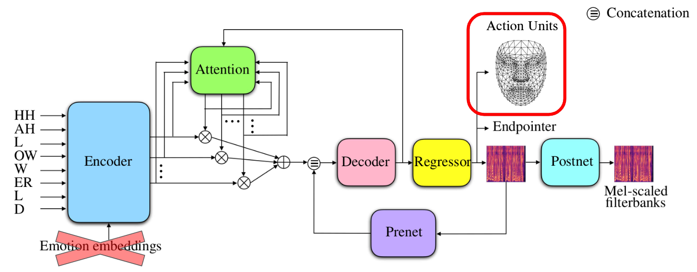

This repository shares the implementation of the Audiovisual Text-To-Speech model AVTacotron2 used as a baseline in the paper: [FastLips: an End-to-End Audiovisual Text-to-Speech System with Lip Features Prediction for Virtual Avatars]().

This implementation is branched from the [NVIDIA PyTorch Implementation](https://github.com/NVIDIA/tacotron2) of Tacotron2 with addition of the audiovisual synthesis module proposed by Ahmed H. Abdelaziz and Anushree P. Kumar et al: [AVTacotron2](https://dl.acm.org/doi/abs/10.1145/3462244.3479883). This implementation is our interpretation of the model described by the authors of this paper and may not fully replicate their model.

# AVTacotron2

The AVTacotron2 architecture follows the Tacotron2 architecture described in [Natural TTS Synthesis By Conditioning Wavenet On Mel Spectrogram Predictions](https://arxiv.org/pdf/1712.05884.pdf) for the prediction of mel-spectrograms. mel-spectrogram frames are predicted from a linear projection after the second LST layer of the decoder. In AVTacotron2, visual features are predicted from a second linear projection implemented on the same layer. These visual features are not integrated in the autoregressive process. No postnet is implemented on the visual features.

This implementation of AVTacotron2 replaces the original Blendshape coefficients by the Action Units (AU) used to drive the deformation of the 3D model of a virtual avatar. The AU sequence is predicted with the same sampling rate as the mel-spectrogram.

This implementation does not include emotion modeling.

# Modifications to the [NVIDIA Implementation](https://github.com/NVIDIA/tacotron2)

## Data Loading
1. adaptation of text/__init__.py, text/symbols.py and text/cmudict.py to the [French corpus](https://zenodo.org/records/7560290#.Y85YpC_pMzw) shared by [Blizzard Challenge 2023](https://hal.science/hal-04269927/document) Organizers
2. addition of visual parameters in hparams.py
3. loading of AU in data_utils.py: AU are up/down-sampled to follow the sampling rate of the mel-spectrogram

## Visual Prediction
4. prediction of the AU sequence in model.py
5. computation of the visual loss (Mean Squared Error summed to the total loss) in loss_function.py during training

## Inference
6. creation of an inference script: do_syn.py (combined with [Waveglow](https://github.com/NVIDIA/waveglow), not described here)

# Demo Page
Visit our [demo page](http://ssw2023.org/demo/FastLips/index.html) for video samples of our virtual avatar driven by audiovisual features predicted with AVTacotron2 and our proposed FastLips model. 

# Quickstart

## Pre-requisites
1. NVIDIA GPU + CUDA cuDNN

## Setup
1. Download/Clone this repo
2. Install python requirements: `pip install -r requirements.txt`
3. Update hparams.py:
    1. wav-/mel-paths and load_mel_from_disk to compute mel-spectrograms dynamically during runtime or use pre-processed spectrograms
    2. training-/validation files
    3. prefix and suffix audio/visual toward your data repositories

## Training
`python train.py --output_directory=outdir --log_directory=logdir`

## Alternatively download our pretrained model
Download and unzip the folder outputs_GIPSA from this [Google Drive repository](https://drive.google.com/drive/folders/1xTGZ4QUYZrDl3KLGQEtXbq05Z3yh9FMU?usp=sharing).

## Inference
`python do_syn.py`

# Acknowledgements
This research has received funding from the BPI project THERADIA and MIAI@Grenoble-Alpes (ANR-19-P3IA-0003). This work was granted access to HPC/IDRIS under the allocation 2023-AD011011542R2 made by GENCI.

# Citation
    @inproceedings{lenglet24_interspeech,
      title     = {FastLips: an End-to-End Audiovisual Text-to-Speech System with Lip Features Prediction for Virtual Avatars},
      author    = {Martin Lenglet and Olivier Perrotin and Gerard Bailly},
      year      = {2024},
      booktitle = {Interspeech 2024},
      pages     = {3450--3454},
      doi       = {10.21437/Interspeech.2024-462},
      issn      = {2958-1796},
    }
